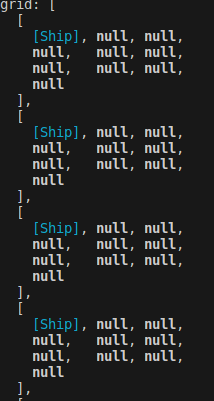

    Battleship

`Description: `
- this project implements the classic game 'Battleship', that has 2 players, ruled grid on which each player's fleet of warships are marked. The locations of the fleets are concealed from the other player. Players alternate turns calling "shots" at the other player's ships, and the objective of the game is to destroy the opposing player's feet.

`Difficulties encountered:`
- while building the method to return the direction of the ship to place it `(gameboard-place ship(direction))`, I have thought that what I have built was wrong, but it was actually what I needed to do -> "i need to sketch down more in the future, I did not build the DOM interface yet, so i do not have any better display than the terminal", but the terminal was displaying like this:

;

`General overlook of project progress:`

- node output in the terminal of the `2D Array`, with 2 placed ships( 1 horizontally and 1 vertically), "x" marking the `fired shot` at that ship's square

(ship is showing 10x10 array but was too long to add everything in single picture)

- Page setup sketch + ideas

