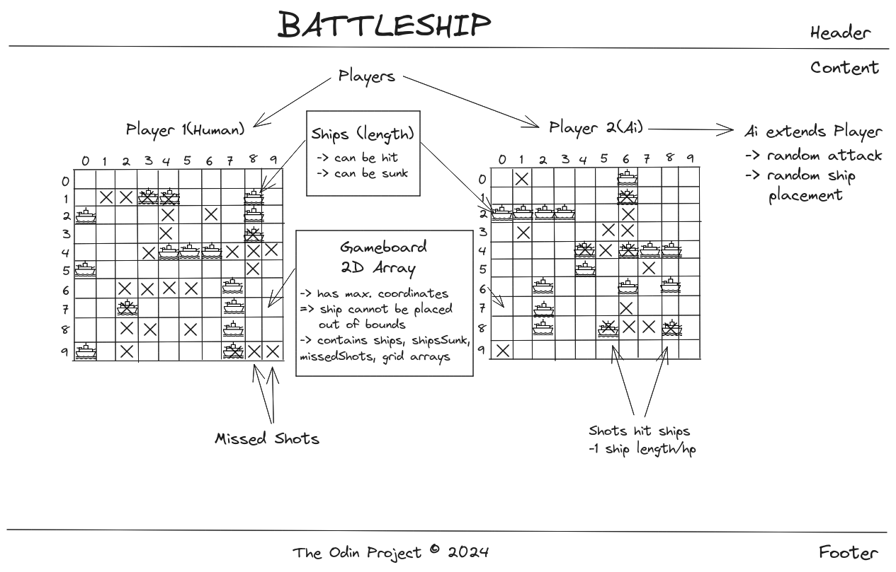
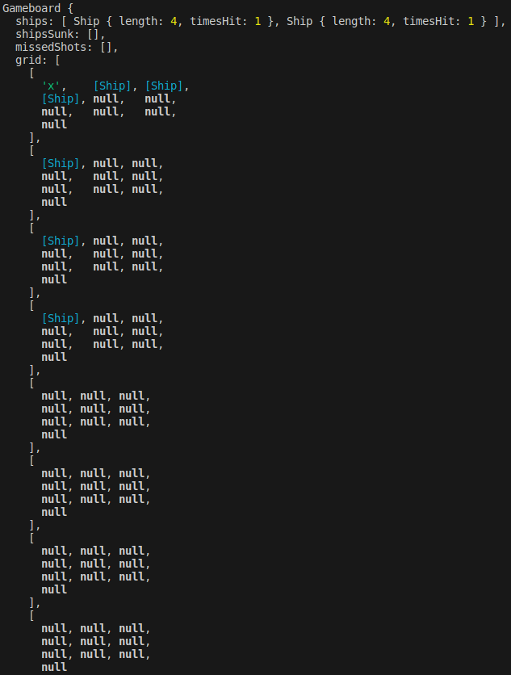
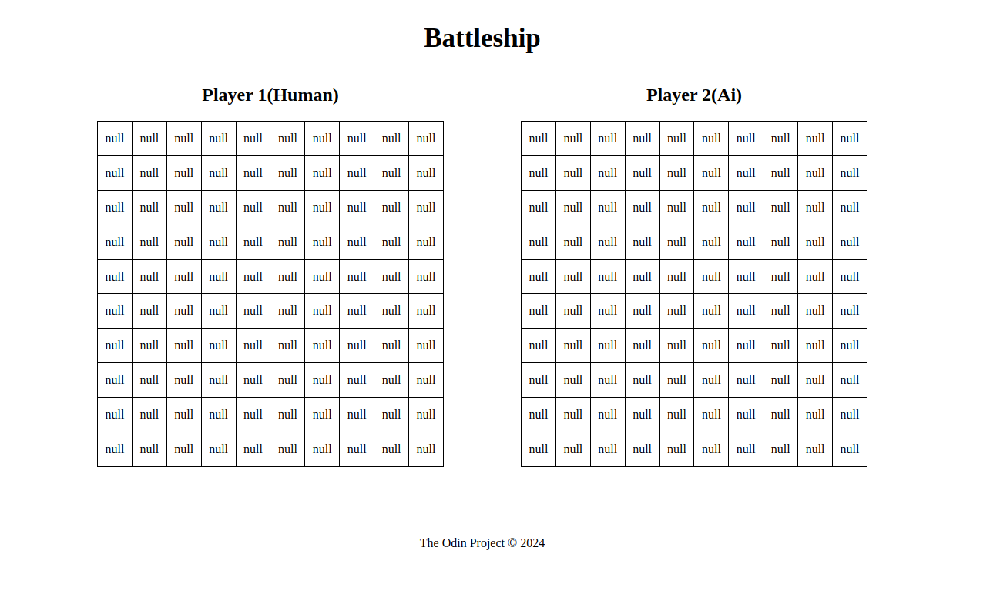
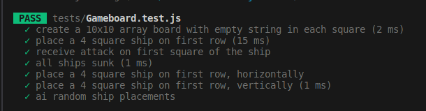
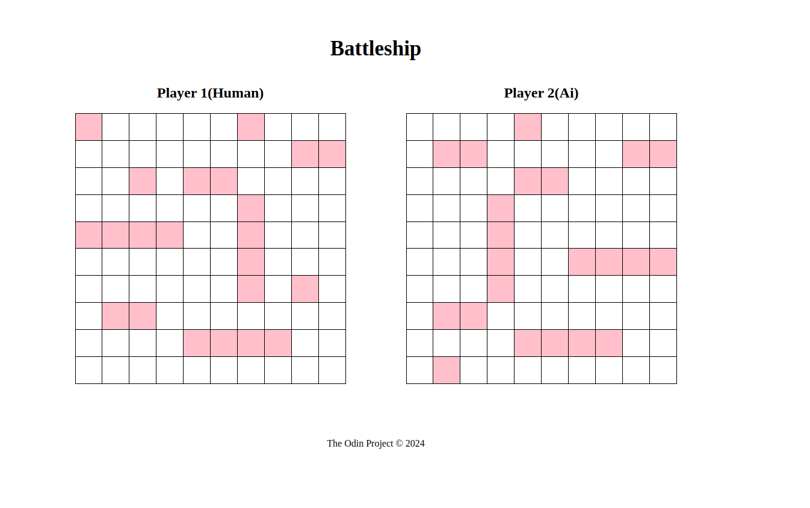
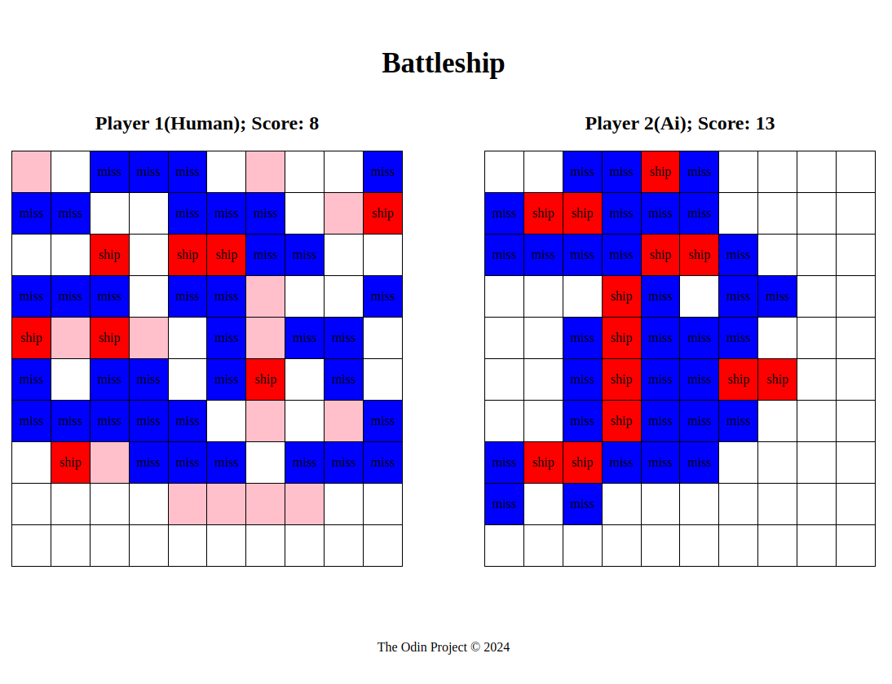
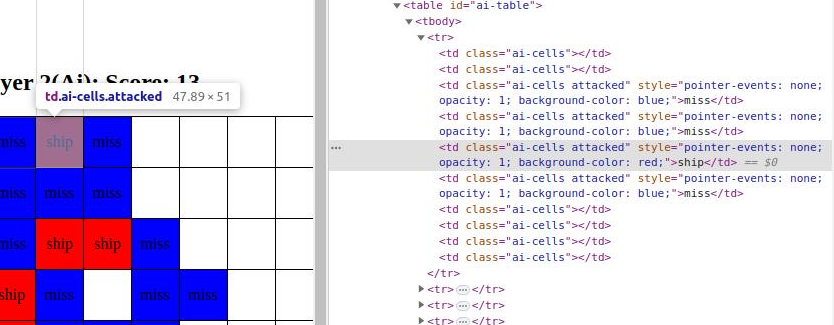
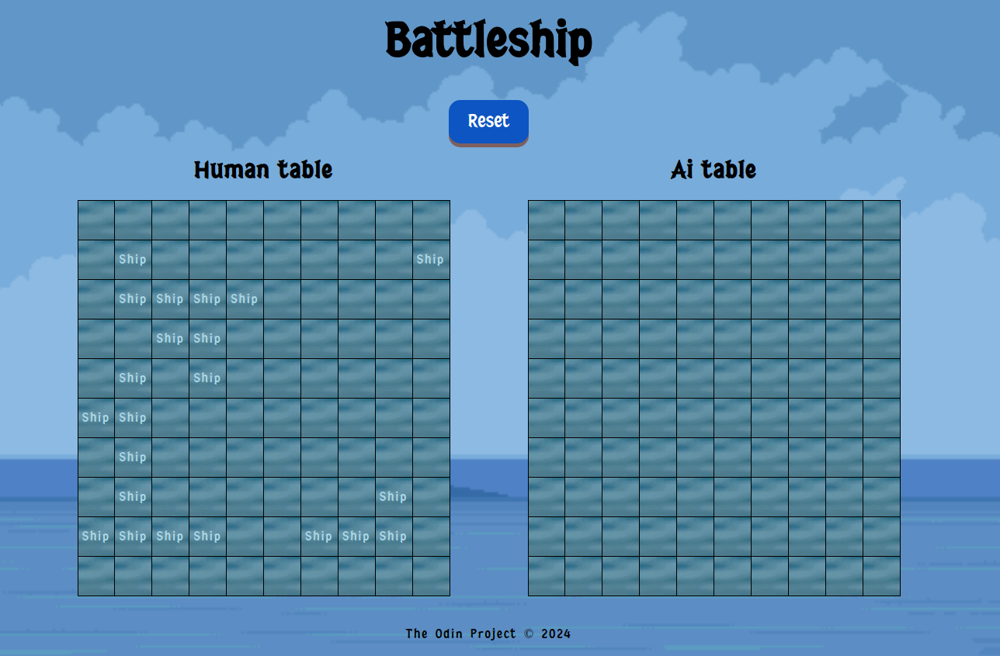

## Battleship

This project is a single-player version of the classic _Battleship_ game, where the player faces off against an AI. The player’s fleet of warships is placed on a grid, and the AI's fleet is hidden. Players take turns firing shots at the opponent's grid, with the objective being to destroy the opposing fleet before their own is sunk.

### Demo

### Technologies used

- **JavaScript** : Core game logic and interactions
- **HTML & CSS**: Structure and styling
- **Jest**: Unit testing
- **ESLint, Prettier**: Code linting and formatting
- **Webpack**: Module bundler for efficient development

### Challenges faced

**Linking backend and frontend**
Rendering a 2D array onto an HTML table was one of the most significant challenges. I found a helpful StackOverflow thread by [Vishnu Shenoy](https://stackoverflow.com/questions/64284979/mapping-2d-array-javascript-into-html-table) to assist with this.
Additionally, I organized the game parameters using objects to better manage the complexity of the game logic, a tip I picked up from [Carlos](https://github.com/bycdiaz).

**Ship placement validation**
Ensuring that ships are placed correctly was crucial.

- Ships remain within the board's bounds
- Ships do not overlap or occupy the same square multiple times

### Planning

### Progress

**2D Array Example**: Here's an example of a 2D array with two ships placed on the grid—one horizontally and one vertically. Fired shots are marked as "x" on the ship's coordinates.

#### Final View

### Improvements needed

- **AI Move Delay**: Add a delay between the player’s and AI's moves to ensure the AI doesn’t skip its turn

  **UI Enhancements**:

- Remove "[object object]" writing at ai table so player where the ship is / just change mouse style ✅
- Make the UI more visually appealing with a more polished design.
- **Reset Button**: Implement a reset button to allow players to restart the game

- **Animations and Transitions**: Improve the UI with animations and transitions for better visual feedback on hits and misses.

- **Deploy** ✅

#### Freeware, Non-Commercial Credits

- [Font](https://www.fontspace.com/j-juvanze-font-f112038)
- [Background image](https://opengameart.org/users/craftpixnet-2d-game-assets)
- [Xplosion Effect](https://pixabay.com/users/placidplace-25572496/)
- [Crosshair](https://icons8.com/icons/set/crosshair)
