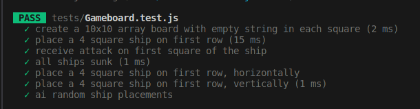
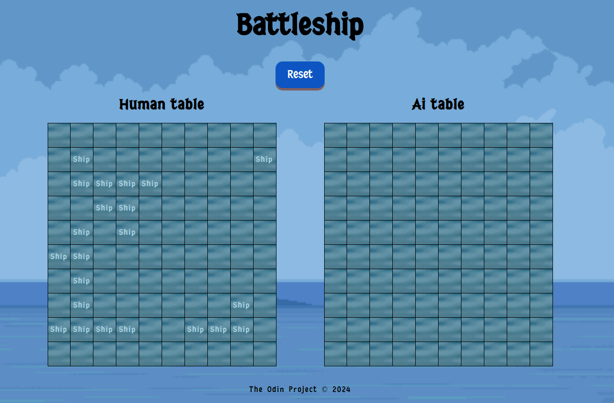

## Battleship 🎮

### Description

This project implements the classic game Battleship, a two-player game where each player places their fleet of warships on a ruled grid. The locations of each fleet are concealed from the opponent. Players take turns "firing shots" at the opponent's grid, and the objective is to destroy the opposing fleet before yours is destroyed.

### Technologies used

- JavaScript (Vanilla): Core game logic and interactions
- HTML, CSS: Structure and styling
- Jest: Unit testing
- ESLint, Prettier: Code linting and formatting
  Webpack

### Setup and installation

1. Clone the repository
2. Install dependencies using `npm install`
3. Run the server `npm run start`
4. Open browser at http://localhost:8080

### The game in action

### Challenges faced

1. Linking backend and frontend
   Rendering a 2D array to an HTML table was a significant challenge. I found this [StackOverflow](https://stackoverflow.com/questions/64284979/mapping-2d-array-javascript-into-html-table) thread by Vishnu Shenoy particularly helpful
   I structured game parameters as objects to manage the growing complexity of the game's logic, thanks to a tip from [Carlos](https://github.com/bycdiaz)

2. Ship placement validation
   Ensuring valid ship placement by checking:

- Ships remain within the board's bounds
- Ships do not overlap or occupy the same square multiple times

### Planning

### Progress

- Example of a 2D array with two placed ships (1 horizontal and 1 vertical).
  "x" marks fired shots at those ship squares.

#### Final

### Improvements needed

- add a delay between player and ai move to make sure a move is not skipped
- remove "[object object]" writing at ai table so player where the ship is / just change mouse style ✅
- make it prettier ✅
- create reset button ✅
- enhance the ui with animations, transitions, visual feedback for hits, misses ✅

- deploy it

#### Freeware, Non-Commercial Credits

- [Font](https://www.fontspace.com/j-juvanze-font-f112038)
- [Background image](https://opengameart.org/users/craftpixnet-2d-game-assets)
- [Xplosion Effect](https://pixabay.com/users/placidplace-25572496/)
- [Crosshair](https://icons8.com/icons/set/crosshair)
