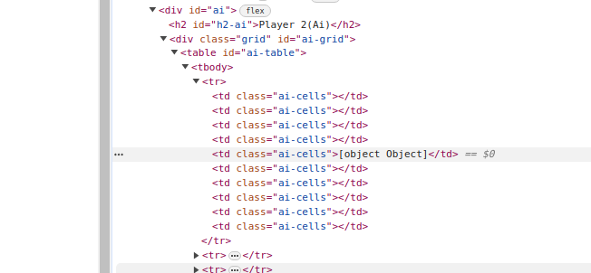

### Battleship

#### Description

- this project implements the classic game 'Battleship', that has 2 players, ruled grid on which each player's fleet of warships are marked. The locations of the fleets are concealed from the other player. Players alternate turns calling "shots" at the other player's ships, and the objective of the game is to destroy the opposing player's fleet.

#### Technologies used

#### Setup and installation

#### The game in action

- gif

#### Difficulties encountered

- initially, I wanted to use images for `ship` and `shot` but those can be placed on the gameboard table only with `appendChild` inside the square cell, which made it a bit complicated, since my focus was on building the battleship logic and ai, so I have finally switched to only use` background-color` property;
- `the most difficult part` of this project was definitely rendering the `2D Array` into the a table directly. Maybe my goal was set too high but I actually made it and it works smooth. (This stackOverflow helped me lots [StackOverflow](https://stackoverflow.com/questions/64284979/mapping-2d-array-javascript-into-html-table) by Vishnu Shenoy). Additional to it I have used an object for the parameters since I have more than two parameters to keep it organized. Thanks to [Carlos](https://github.com/bycdiaz) for the tip!

#### General overlook of project progress

- node output in the terminal of the `2D Array`, with 2 placed ships( 1 horizontally and 1 vertically), "x" marking the `fired shot` at that ship's square

(ship is showing 10x10 array but was too long to add everything in single picture)

#### Page setup sketch + ideas

#### Progress

- if a cell was attacked it will give it a class `attacked`, so it will not be possible to attack it again. With a while loop, the ai is set to attack until it finds a cell that was not attacked for its turn
  

After coming back to battleship after 1 year:

#### Improvements needed

- add a delay between player and ai move to make sure a move is not skipped

- remove "[object object]" writing at ai table so player where the ship is / just change mouse style ✅

- change blue color for miss since dark writing is not very readable on a dark blue font

- create reset button

- enhance the ui with animations, transitions, visual feedback for hits, misses

- deploy it

##### Freeware, Non-Commercial Credits

Font: [Juvanze](https://www.fontspace.com/j-juvanze-font-f112038)

Background image: [CraftPix.net 2D Game Assets](https://opengameart.org/users/craftpixnet-2d-game-assets)
